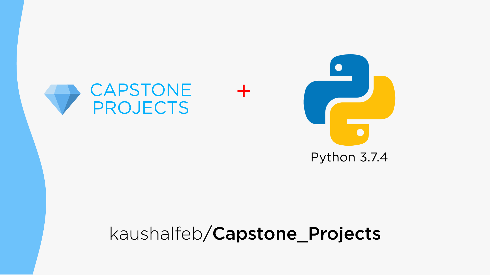

# Capstone_Projects

> This repository has a collection of projects build with Python 3.7 
> Project cover a myriad of domains including Math, Networking, GUI, Multimedia etc 
---
### List of Projects:
1. Pi upto N digits
2. e upto N digits
3. Fibonacci Series
4. Prime Factorization 
5. Next Prime Number
6. Cost of Tile to Cover W x H Floor
7. Mortgage calculator
8. Change Return program
9. Binary to Decimal and Decimal to Binary convertor
10. Calcultor
11. Unit convertor
12. Alarm Clock
13. Credit Card Validator
14. Factorial Calculator
15. Happy Numbers
16. Complex Numbers
17. Coin Flip Simulation